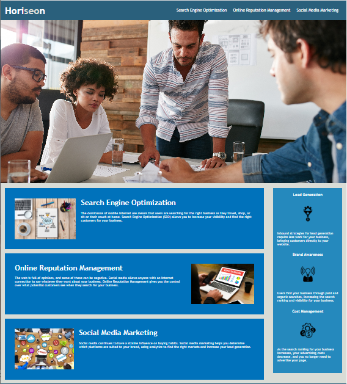

# Make It Better project

## Description

This project is a demonstration of the web development phrase, "first make it
work, then make it better!" This project refactors HTML and CSS code to meet
accessibility standards, which is achieved through the following methods: •
Using semantic HTML elements • Follow a logical structuring of the code, and
sequential use of headings • Aiding accessibility by including alt attributes on
images • Ensuring links are working • Removing redundant styles A neater, and
easier to understand code, with clear, concise use of comments, adds additional
long term sustainability of the code. The existing styling and layout of the web
application is to remain the same.

_What simple methods can be easily adapted into a pre exisiting code base to
provide accessibility?_ This projects provides a solution to this problem. By
making small changes to your code can have significant positive effects for the
user's of the application, as well as future updates to the code.

## Installation

This project can be accessed through GitHub and does not require further
installation.

## Usage

View the full HTML and CSS code base from the repository.

The finished project must match the layout and styling as visible below:

To view the starter code, and the process followed to refactor the code at each
step: • select the Pull requests tab, then select closed. • Select a pull
request, then select Files changed. This will highlight changes made at each
step.

View the full application live via the following link:
https://christinelea.github.io/make-it-better/

## Roadmap

Upcoming features is to make the web application responsive to different screen
sizes using media queries.

## Authors and acknowledgment

Acknowledgment to the Monash University, Melbourne, edX boot camp course which I
am currently undertaking.

## License

MIT License
